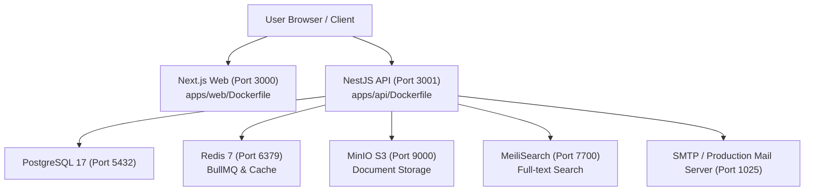

# NUROX ERP — Production Deployment Guide

> **Version:** 1.0 · **Updated:** June 2026
> **Stack:** Next.js 16.2 · NestJS 11.0 · PostgreSQL 17 · Redis 7 · MinIO · MeiliSearch · Docker Compose

---

## 1. System Architecture Overview



---

## 2. Quick Start: 1-Command Production Launch

To launch the full containerized stack using `docker-compose.yml` and `.env.docker`:

```bash
# 1. Boot all containers in detached mode
pnpm docker:up

# 2. Verify stack health & seeded credentials
node scripts/docker-verify.js
```

To stop or inspect logs:

```bash
# View live logs across all containers
pnpm docker:logs

# Stop all containers and preserve volumes
pnpm docker:down
```

---

## 3. Container Services Specification

| Service            | Container Name      | Port(s)                  | Image / Build Context        | Healthcheck Endpoint                      |
| :----------------- | :------------------ | :----------------------- | :--------------------------- | :---------------------------------------- |
| **API**            | `nurox_api`         | `3001:3001`              | `apps/api/Dockerfile`        | `http://localhost:3001/api/health`        |
| **Web**            | `nurox_web`         | `3000:3000`              | `apps/web/Dockerfile`        | `http://localhost:3000/en/login`          |
| **PostgreSQL**     | `nurox_postgres`    | `5432:5432`              | `postgres:17-alpine`         | `pg_isready -U nurox -d nurox_db`         |
| **Redis**          | `nurox_redis`       | `6379:6379`              | `redis:7-alpine`             | `redis-cli ping`                          |
| **MinIO S3**       | `nurox_minio`       | `9000:9000`, `9001:9001` | `minio/minio:latest`         | `http://localhost:9000/minio/health/live` |
| **MeiliSearch**    | `nurox_meilisearch` | `7700:7700`              | `getmeili/meilisearch:v1.12` | `http://localhost:7700/health`            |
| **MailHog / SMTP** | `nurox_mailhog`     | `1025:1025`, `8025:8025` | `mailhog/mailhog:latest`     | TCP Port check                            |

---

## 4. Environment Configuration (`.env.docker`)

Ensure the following variables are configured in `.env.docker` before deploying to production:

```env
# Node Environment
NODE_ENV=production
PORT=3001

# Database Configuration
DB_HOST=postgres
DB_PORT=5432
DB_USERNAME=nurox
DB_PASSWORD=nurox_prod_password
DB_NAME=nurox_db

# Redis & Cache
REDIS_HOST=redis
REDIS_PORT=6379

# Object Storage (MinIO / AWS S3)
S3_ENDPOINT=http://minio:9000
S3_ACCESS_KEY=minioadmin
S3_SECRET_KEY=minioadmin
S3_BUCKET_NAME=nurox-documents

# Search Engine (MeiliSearch)
MEILI_HOST=http://meilisearch:7700
MEILI_MASTER_KEY=nurox_meili_master_key

# JWT & Authentication Secrets
JWT_SECRET=production_jwt_secret_change_me_in_prod
JWT_EXPIRATION=15m
REFRESH_TOKEN_SECRET=production_refresh_token_secret_change_me

# Next.js Frontend Public API Base URL
NEXT_PUBLIC_API_URL=http://localhost:3001/api/v1
```

---

## 5. Security & Container Best Practices

1. **Non-Root Execution**: `apps/api/Dockerfile` runs as user `nestjs:nodejs` and `apps/web/Dockerfile` runs as user `nextjs:nodejs`.
2. **Multi-Stage Builds**: Unnecessary build toolchains (TypeScript compiler, Turbo CLI) are stripped from production runner containers to minimize attack surface and image size.
3. **Database Security**: Ensure `POSTGRES_PASSWORD` and `JWT_SECRET` are replaced with strong, cryptographically generated secrets before public deployment.
4. **TLS / Reverse Proxy**: Place an NGINX, Caddy, or Cloudflare reverse proxy in front of ports 3000 (Web) and 3001 (API) to enforce HTTPS with SSL/TLS certificates.

---

## 6. Seeded Default Credentials

Upon first startup (`DOCKER_DB_BOOTSTRAP=true`), the system auto-populates the database with initial tenant & super-admin credentials:

- **Admin Login**: `admin@nurox.app`
- **Default Password**: `password123`
- **Super-Admin Tenant**: Default Tenant ID `00000000-0000-0000-0000-000000000001`
